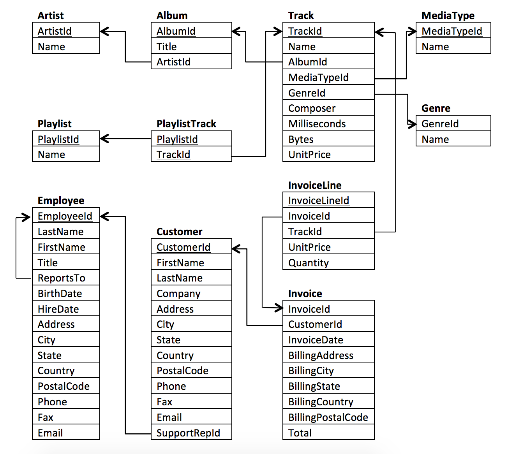

# SQL_Basics
Programs for the Basics of SQL

Chinook Database 
chinook.sql: 
<figure>
    
    <figcaption>Chinook ERM - https://m-soro.github.io/Business-Analytics/SQL-for-Data-Analysis/L4-Project-Query-Music-Store/</figcaption>
</figure>
